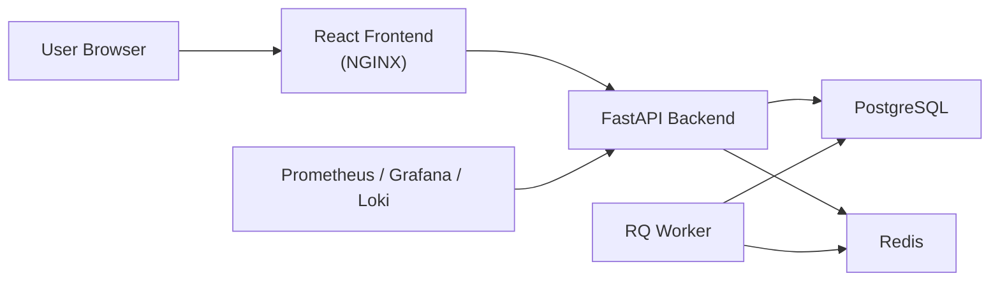

# TaskFlow Architecture

TaskFlow is a multi-service learning platform that starts with Docker Compose and can be promoted to Kubernetes + Helm with the same service boundaries.

## Services

- `frontend`: React/Vite app bundled into an unprivileged NGINX container.
- `backend`: FastAPI API with auth, tasks, health, and metrics endpoints.
- `worker`: Python RQ worker that consumes reminder jobs from Redis.
- `postgres`: primary relational store for users and tasks.
- `redis`: queue and cache backend for reminder workflows.

## Runtime layers

- Local dev: `docker compose up --build`
- Kubernetes base: raw manifests in `infra/k8s/base/`
- Release packaging: Helm chart in `infra/helm/taskflow/`
- CI/CD: GitHub Actions in `.github/workflows/ci-cd.yml`

## Security baseline

- Dedicated ServiceAccounts for each workload
- Pod security labels on the raw namespace manifest
- Read-only root filesystems on app-facing deployments
- NetworkPolicies for default deny plus explicit service traffic
- Policy checks in `policy/kubernetes.rego`
